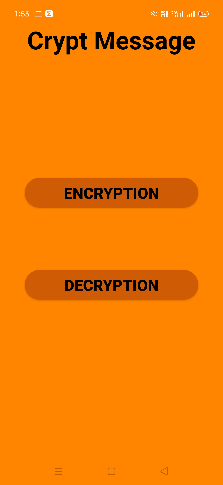
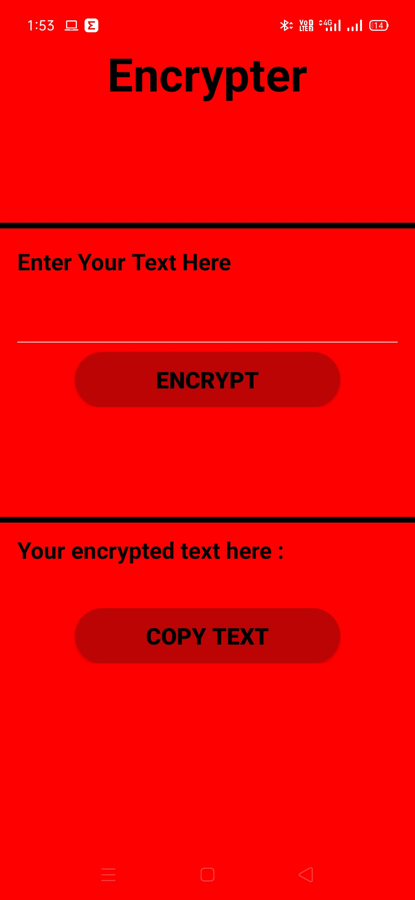
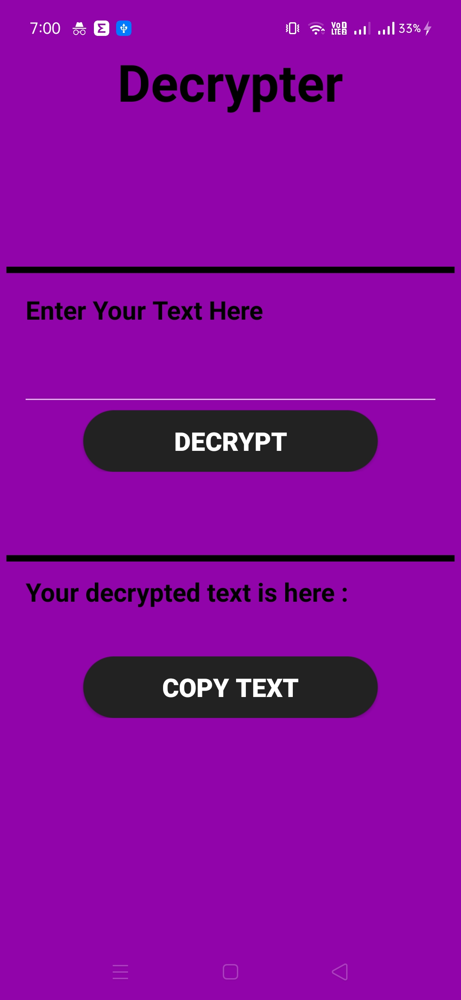
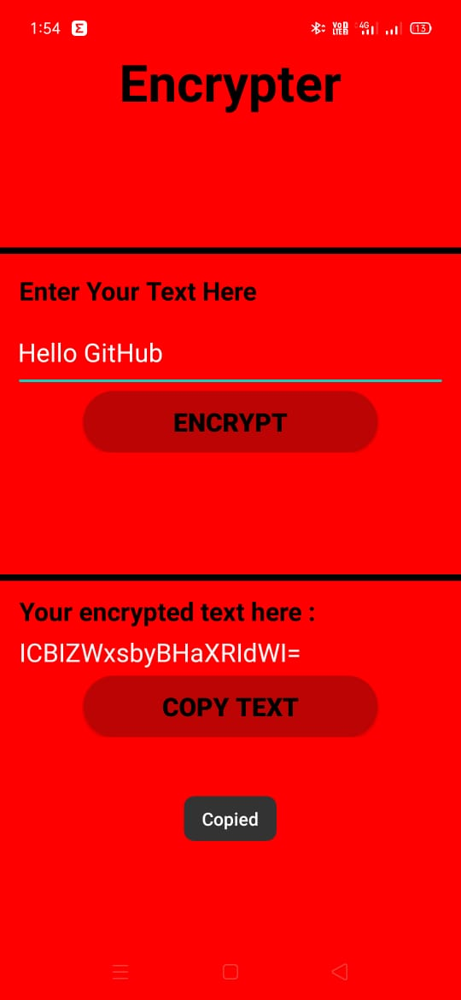
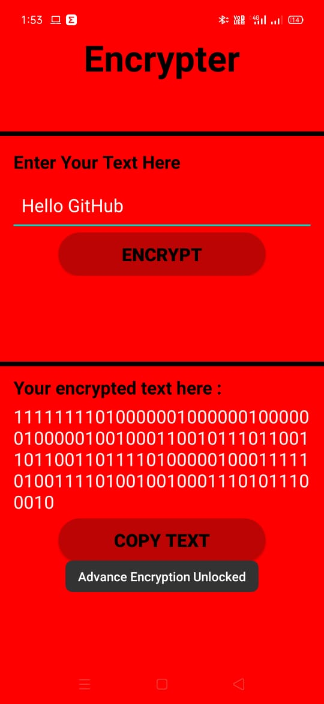
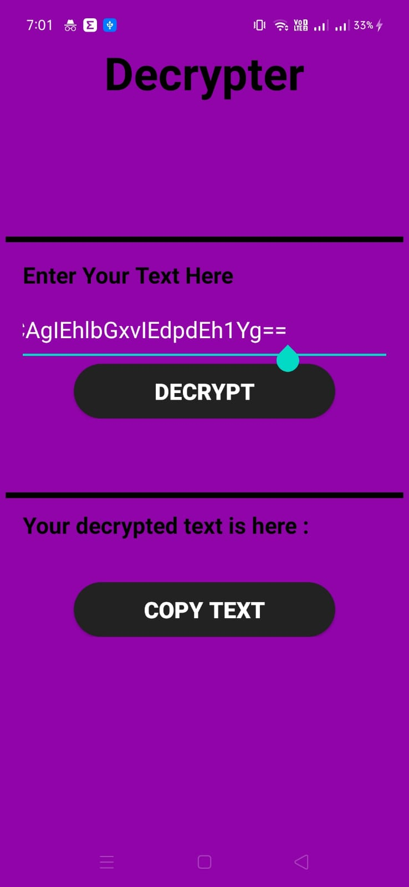
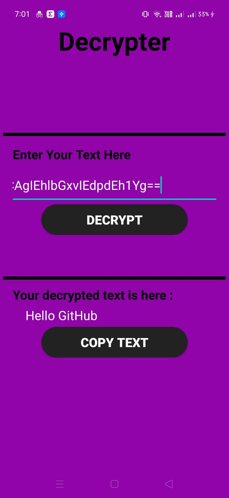
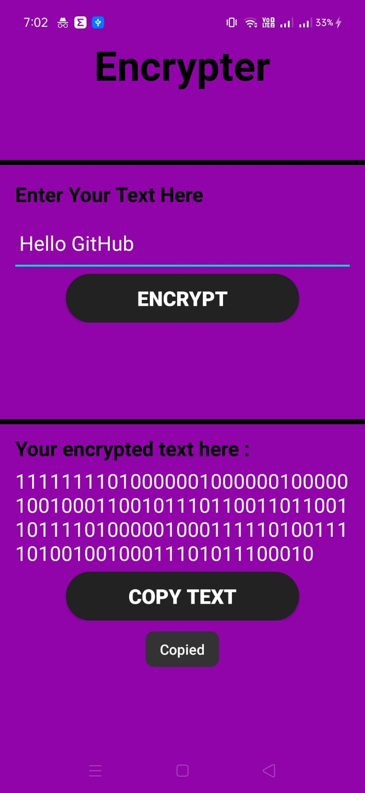
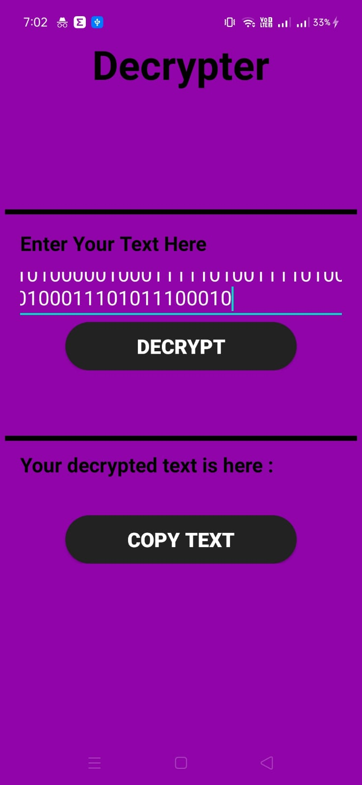

# Crypt-Message

Crypt-Message is an Android Application that can Encrypt and Decrypt a message using the Encoding and Decoding algorithm respectively. The app’s homepage will give the user two option:

Encryption: It is the process of transforming a readable message into an unreadable one. To do so we use encoding algorithms.

Decryption: It is the process of transforming data or information from an unreadable to readable form. To do so we use decoding algorithms


## Custom Feature
* On Long click on 'ENCRYPT BUTTON' in 'ENCRYPTION Activity' a custom encrytption algorithm will be used in the backend to change your text into binary code which will be more secure
* And to DECRYPT that binary code into normal text you have to Long click on the 'DECRYPT BUTTON' in "DECRYPTION Activity'


## Pre-requisites
* Android SDK v24
* Android Build Tools v23.0.3
* Android Support Repository v24.1.1


## Installation
Clone this repository and import into **Android Studio**
```bash
git clone https://github.com/neelangshu007/Crypt-Message-App.git
```

## Getting Started
This sample uses the Gradle build system. To build this project, use the "gradlew build" command or use "Import Project" in Android Studio.


## Contributing

1. Fork it
2. Create your feature branch (git checkout -b my-new-feature)
3. Commit your changes (git commit -m 'Add some feature')
4. Run the linter (ruby lint.rb').
5. Push your branch (git push origin my-new-feature)
6. Create a new Pull Request


## Crypt Message App Screenshots









